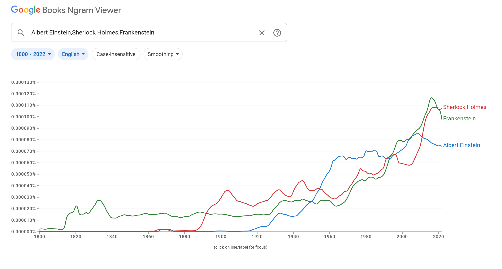
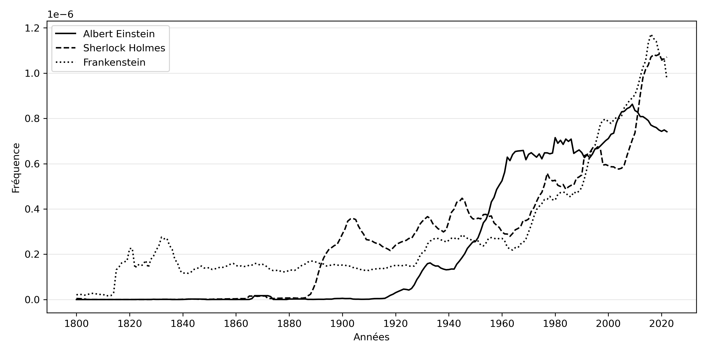
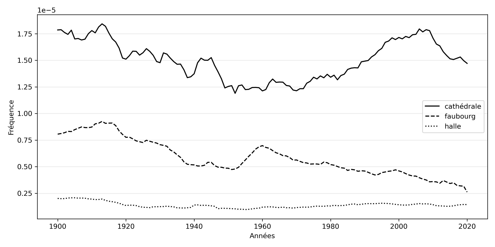
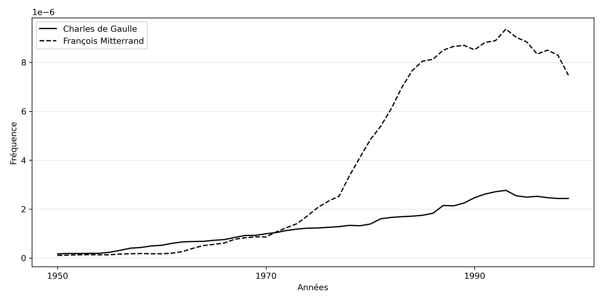

1) **Purpose of the original idea :**   

My friend Eric wanted to insert "google ngrams graph" in his book. The aim of this script is to be able to generate graphics in high resolution and in black and white from google ngrams (https://books.google.com/ngrams) 

Hopefully there is a json API which allows us to call "google ngrams", receive the data and then use them for different purpose.  

This script will use the mandatory argument  -k "keyword1,keyword2,...,<up to keyword6>" and generate a black and white graph in PNG format. 

Basically using the exemple of google  (screenshot): 


The output of the script will produce such graph in a PNG file:  



That's all folks ! 


.   
2) **limitation :**   

- It will generates graph in BLACK and WHITE (easily modifiable in source code)
- Min number of keyword is 1
- Max number of keywords is actually 6


.   
3) **Dependancies:**   

Debian 13 (Trixie) :   
- python3-matplotlib   
- python3-requests   

Windows:   
- pip install requests   
- pip install matplotlib    


.   
4) **Use:**   

```
> ngram_2_graph -h 
```
```
Usage: ngram_2_graph.py [-h][-s start_date][-e end_date][-o output_prefix] -k keyword1,keyword2 
   eg: python ./ngram_2_graph.py -k "cathédrale,faubourg,halle"

Options:
  -h, --help            show this help message and exit
  -k  keyword1,keyword2
                        keywords list separated by comma : keyword1,keyword2
  -s start year, --start_date=start year
                        start date (year) must be an integer
  -e end year, --end_date=end year
                        end date (year) must be an integer
  -c corpus, --corpus=corpus
                        corpus language : fr , en, en-GB, en-US
  --corpora=corpora     corpora : eng_gb_2019, fre_2019
  -o prefix, --prefix=prefix
                        prefix for graph name
  -j json, --json=json  json input for graph (no ngram interrogation)
  -p                    print and generated graph on the screen
  -v                    Verbose, display more information

```

5) **exemples:**   

- to plot the words *"cathédrale"* and *"faubourg"* and *"halle"* in french with actual corpora between 1900 and 2020:
```
./ngram_2_graph.py -k "cathédrale,faubourg,halle" --corpus fr --start_date 1900 --end_date 2020
```


- to plot google ngram default exemple: *"Albert Einstein,Sherlock Holmes,Frankenstein"*
```
./ngram_2_graph.py -k "Albert Einstein,Sherlock Holmes,Frankenstein" --corpus en
```


- to plot words *"cathédrale, faubourg, halle"* in french with the coporas fre_2019   
Refere to exlanation of **"Corpora"** on [google ngrams docs](https://books.google.com/ngrams/info) :
```
./ngram_2_graph.py -k "cathédrale,faubourg,halle" --corpus fr --corpora fre_2019 
```


.   
- to plot words *"Charles-de-Gaulle_François-Mitterrand.png"* between 1950 and 1999   
```
./ngram_2_graph.py  -k "Charles de Gaulle,François Mitterrand"  --corpus=fr --start_date=1950 --end_date=1999
```


.   
Note: for Eric own process there is a capability to replot them offline - this can be called with the option  --json <existing json ngram file> : this explain why each time that the script is called  data are saved in a json file.
